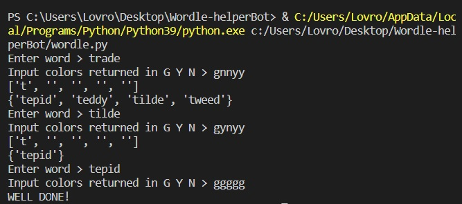

# Woordle-helper
Python helper bot for solving daily woordle. 
### Current state:
able to identify between green, yellow and none(n) colors. Green means letter is in the word and in right position, yellow letter is in the word but different position and none (n) letter is not in the desired word. 

 
Current known flaw: 
Return empty set if word contains two of the same letter (tenet), double t and e if marked once will eliminate possibility of appering again. 

